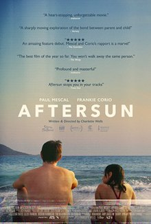

### Un zine cinématographique. 

> *Ecrire, c'est reconnaître ce qui s'est déjà écrit. Dans le film (le film comme dépot organisé de signes) et dans moi (organisé par un dépot de traces mnésiques qui, à la longue, constituent aussi mon histoire).* 
> 
> Serge Daney

